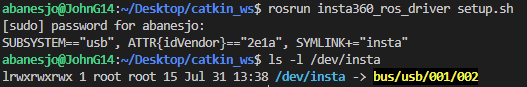
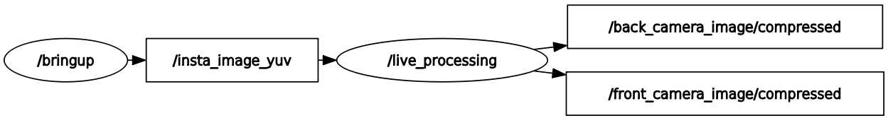
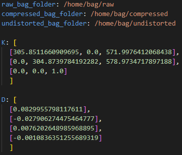
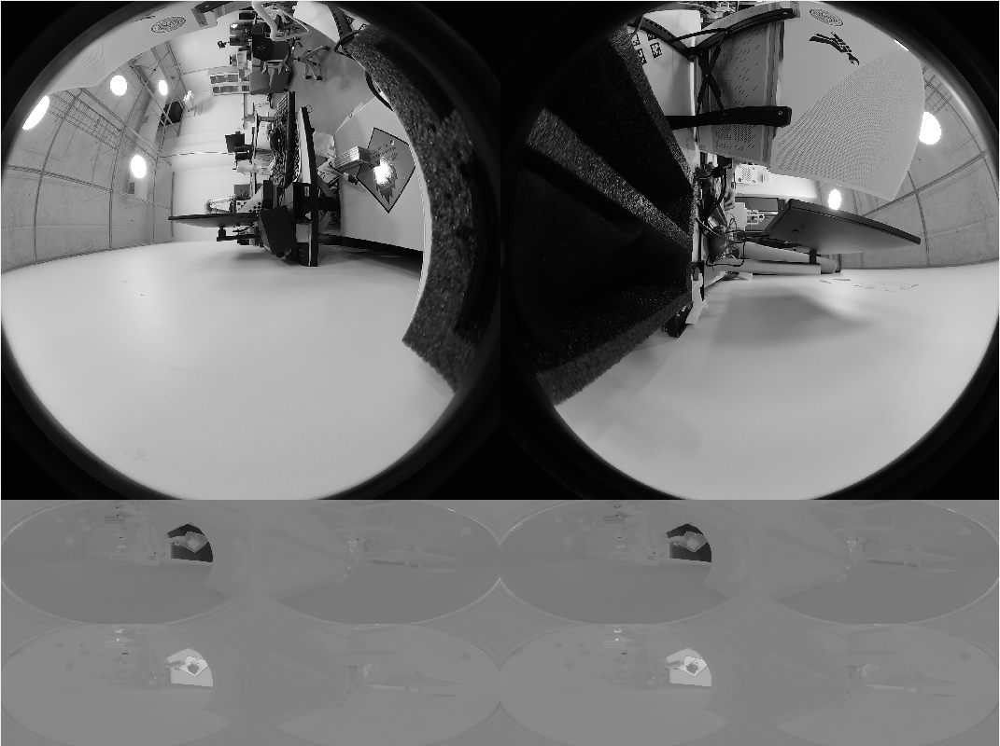
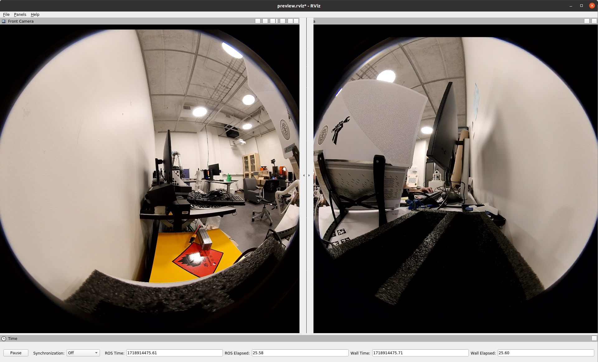
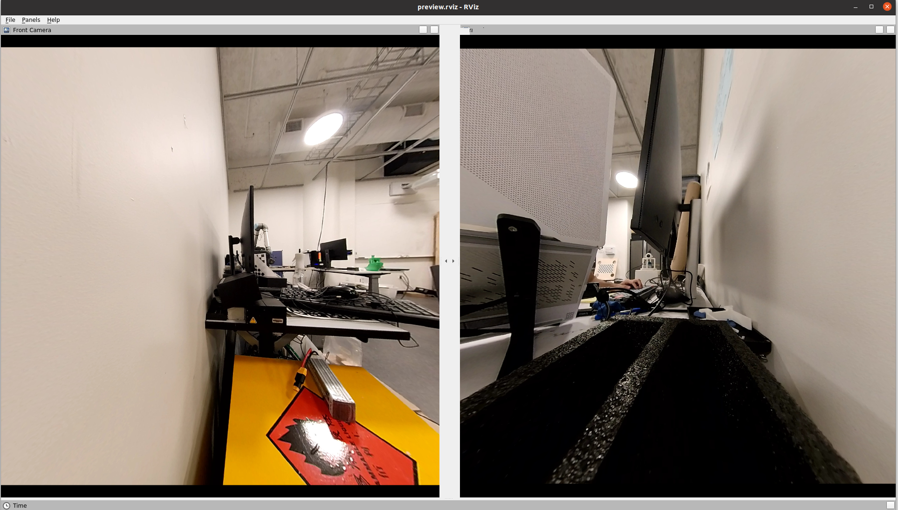

# insta360_ros_driver

A ROS driver for the Insta360 cameras. This driver is tested on Ubuntu 20.04 with ROS Noetic. The driver has also been verified on the Insta360 X2 and X3 cameras.

## Installation
To use this driver, you need to first have Insta360 SDK. Please apply for the SDK from the [Insta360 website](https://www.insta360.com/sdk/home). 

```
cd ~/catkin_ws/src
git clone https://github.com/ai4ce/insta360_ros_driver
cd ..
```
Then, the Insta360 libraries need to be installed as follows:
- add the <code>camera</code> and <code>stream</code> header files inside the <code>include</code> directory
- add the <code>libCameraSDK.so</code> library under the <code>lib</code> directory.

Afterwards, install the other required dependencies and build
```
rosdep install --from-paths src --ignore-src -r -y
catkin build
```

The Insta360 requires sudo privilege to be accessed via USB. To compensate for this, a udev configuration can be automatically created that will only request for sudo once. The camera can thus be setup initially via:
```
rosrun insta360_ros_driver setup.sh
```
This creates a symlink  based on the vendor ID of Insta360 cameras. The symlink, in this case <code>/dev/insta</code> is used to grant permissions to the usb port used by the camera.


## Usage
This driver directly publishes the video feed in YUV format, since that is the camera's native setting. Alongside this, the driver also publishes the camera feed as standard BGR images to the <code>/front_camera_image/compressed</code> and <code>/back_camera_image/compressed</code> topics. Note that the compressed images have some amount of latency (~50 ms) compared to the raw output. 

### Camera Bringup
The camera can be brought up with the following launch file
```
roslaunch insta360_ros_driver bringup.launch
```

This publishes the raw yuv and compressed images as the following topics
- /insta_image_yuv
- /front_camera_image/compressed
- /back_camera_image/compressed

The launch file has the following optional arguments:
- compress (default="true")

Enables the <code>/live_processing</code> which publishes the compressed front and back images. When set to false, only the raw YUV image is published

- undistort (default="false")

When set to true, the <code>/live_processing</code> node will also use the specified intrinsic matrix, found in <code>config/config.yaml</code> to undistort the images in real-time. **Note that this process can reduce the frame rate and/or increase latency.** It is therefore recommended to keep it as 'false' and perform undistortion in post-processing, as will be shown in the next section.

- debug (default="false")

When set to true, additional diagnostic windows are created. These show the publishing frequency and image size. Note that **xterm** is required for this functionality, and can be installed using the following command.
```
sudo apt-get install xterm
```

### Recording to a Bag File
While the camera driver is active (via the bringup launch file above), data can be recorded to a bag file using
```
roslaunch insta360_ros_driver bag_record.launch
```
**The bag file save locations are specified within <code>config/config.yaml</code>**


The launch file contains one optional argument:
- bag_type (default="compressed", options="\["raw", "compressed", "undistorted"\])

This specifies which directory to save the bag_files to, as specified in <code>config/config.yaml</code> When set to "raw", it will only record the <code>/insta_image_yuv</code> topic. Note that when specifying the <code>bag_type</code> to be "undistorted", <code>undistort:=true</code> must be set for <code>bringup.launch</code>

The Raw YUV image appears as follows:



### Post-Processing: Image Compression and Splitting
Given a bag file containing raw YUV image data, the images can be split to front and back and also compressed using the following launch file.
```
roslaunch insta360_ros_driver bag_compress.launch
```
This launch file reads all the bag files specified in the <code>raw_bag_folder</code> within the <code>config/config.yaml</code> file and outputs bag files containing split and compressed images into the <code>compressed_bag_folder</code> directory. The compressed images are within the <code>/front_camera_image/compressed</code> and <code>/back_camera_image/compressed</code> topics.

After compression and splitting, the images appear as follows:


### Post-Processing: Image Undistortion
Given a bag file containing compressed front and back images, these images can be undistorted using the following launch file.
```
roslaunch insta360_ros_driver bag_undistort.launch
```
This launch file reads all the bag files specified in the <code>compressed_bag_folder</code> within the <code>config/config.yaml</code> file and outputs bag files undistorted images into the <code>undistorted_bag_folder</code> directory. The images are undistorted using the intrinsics specified inside the <code>config/config.yaml</code> file and are within the <code>/front_camera_image/compressed</code> and <code>/back_camera_image/compressed</code> topics.

After undistortion, the images appear as follows:


### Bag Preview
The compressed and undistorted bag files can be previewed using RViz via the following launch file.
```
roslaunch insta360_ros_driver bag_preview.launch
```

The launch file has the following argument:
- bag_file (default="~/bag/undistorted/record.bag")

This is the filepath of the bag file that will be previewed. Please make sure to change this accordingly. 

When launched, an RViz window will be created showing both front and back images, as was previously demonstrated in earlier sections of the documentation