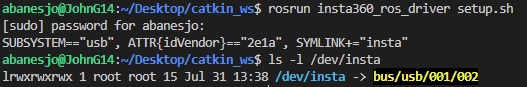
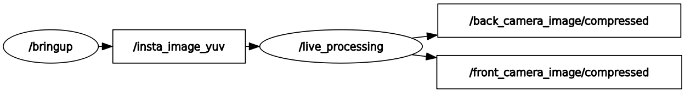

# CHANGES OF THIS FORK
- Dynamic parameters change works correctly
- Equirectangular node is now more efficient
- Perspective node have been added. You can control fov through parameters and camera orientation by publishing to: /&#8288;camera_orientation/&#8288;quaternion

# insta360_ros_driver

A ROS driver for the Insta360 cameras. This driver is tested on Ubuntu 22.04 with ROS2 Humble. The driver has also been verified on the Insta360 X2 and X3 cameras. The following resolutions are available, all at 30 FPS.
- 3840 x 1920
- 2560 x 1280
- 2304 x 1152
- 1920 x 960

You can change [this line](https://github.com/ai4ce/insta360_ros_driver/blob/79588d9e0e9d029c3371d4095ea718daaf1e06fb/src/main.cpp#L126) to edit the resolution.

## Installation
To use this driver, you need to first have Insta360 SDK. Please apply for the SDK from the [Insta360 website](https://www.insta360.com/sdk/home). 

For additional instructions, see this [post](https://github.com/ai4ce/insta360_ros_driver/issues/10#issuecomment-3371481987).

**Note: Please make you use the latest SDK. This package works with the SDK posted after April 23, 2025**

```
cd ~/ros2_ws/src
git clone -b humble https://github.com/ai4ce/insta360_ros_driver
cd ..
```
Then, the Insta360 libraries need to be installed as follows:
- add the <code>camera</code> and <code>stream</code> header files inside the <code>include</code> directory
- add the <code>libCameraSDK.so</code> library under the <code>lib</code> directory.

Afterwards, install the other required dependencies and build
```
rosdep install --from-paths src --ignore-src -r -y
colcon build --symlink-install
source install/setup.bash
```

Before continuing, **make sure the camera is set to dual-lens mode**

Additionally, **ensure the camera's USB mode is set to Android**:
1. On the camera, swipe down the screen to the main menu
2. Go to Settings -> General
3. Set USB Mode to **Android** (not Webcam or other modes)
4. This is required for the ROS driver to properly detect and communicate with the camera (see [Issue #4](https://github.com/ai4ce/insta360_ros_driver/issues/4))

The Insta360 requires sudo privilege to be accessed via USB. To compensate for this, a udev configuration can be automatically created that will only request for sudo once. The camera can thus be setup initially via:
```
cd ~/ros2_ws/src/insta360_ros_driver
./setup.sh
```
This creates a symlink  based on the vendor ID of Insta360 cameras. The symlink, in this case <code>/dev/insta</code> is used to grant permissions to the usb port used by the camera.



**Sometimes, this does not work (e.g. you see "device /dev/insta not found" or something similar). You can try entering the commands manually, since that sometimes sees success, especially for the first time.**
```
echo SUBSYSTEM=='"usb"', ATTR{manufacturer}=='"Arashi Vision"', SYMLINK+='"insta"', MODE='"0777"' | sudo tee /etc/udev/rules.d/99-insta.rules
sudo udevadm control --reload-rules
sudo udevadm trigger
sudo chmod 777 /dev/insta
```

## Usage
The camera provides images natively in H264 compressed image format. We have a decoder node that 

### Camera Bringup
The camera can be brought up with the following launch file
```
ros2 launch insta360_ros_driver bringup.launch.xml
```


A dual fisheye image will be published.


#### Published Topics
- /dual_fisheye/image
- /dual_fisheye/image/compressed
- /equirectangular/image
- /imu/data
- /imu/data_raw

The launch file has the following optional arguments:
- equirectangular (default="false")

This publishes equirectangular images. You can configure these parameters in `config/equirectangular.yaml`.


- imu_filter (default="true")

This uses the [imu_filter_madgwick](https://wiki.ros.org/imu_filter_madgwick) package to approximate orientation from the IMU. Note that by default, we publish `/imu/data_raw` which only contains linear acceleration and angular velocity. The madgwick filter uses this information to publish orientation to `/imu/data`. You can configure the filter in `config/imu_filter.yaml`. 


## Equirectangular Calibration
You can adjust the extrinsic parameters used to improve the equirectangular image. 
```
# Run the camera driver
ros2 run insta360_ros_driver insta360_ros_driver
# Activate image decoding
ros2 run insta360_ros_driver decoder
# Run the equirectangular node in calibration mode
ros2 run insta360_ros_driver equirectangular.py --calibrate
```
This will open an app to adjust the extrinsics. You can press 's' to get the parameters in YAML format. **Note that you need to press 'a' to update the image preview after changing the intrinsics with the GUI**


Pressing 's' will return the parameters via the terminal. You can copy paste this onto the configuration file as needed. By default, the launch file reads this from `config/equirectangular.yaml`

```
==================================================
CALIBRATION PARAMETERS (YAML FORMAT)
==================================================
equirectangular_node:
  ros__parameters:
    cx_offset: 0.0
    cy_offset: 0.0
    crop_size: 960
    translation: [0.0, 0.0, -0.105]
    rotation_deg: [-0.5, 0.0, 1.1]
    gpu: True
    out_width: 1920
    out_height: 960
==================================================
```

Note that decode.py will most likely drop frames depending on your system. If you do not care about live processing, you can simply record the `/dual_fisheye/image/compressed` topic and decompress it later after recording.
```
ros2 bag record /dual_fisheye/image /imu/data_raw
```

## Star History

[](https://star-history.com/#ai4ce/insta360_ros_driver&Date)
