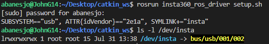
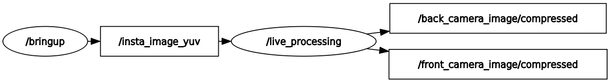

# insta360_ros_driver

A ROS driver for the Insta360 cameras. This driver is tested on Ubuntu 22.04 with ROS2 Humble. The driver has also been verified on the Insta360 X2 and X3 cameras. The following resolutions are available, all at 30 FPS.
- 3840 x 1920
- 2560 x 1280
- 2304 x 1152
- 1920 x 960

You can change [this line](https://github.com/ai4ce/insta360_ros_driver/blob/79588d9e0e9d029c3371d4095ea718daaf1e06fb/src/main.cpp#L126) to edit the resolution.

## Driver Download and Camera Setup
To use this driver, you need to first have Insta360 SDK. Please apply for the SDK from the [Insta360 website](https://www.insta360.com/sdk/home). 

For additional instructions, see this [post](https://github.com/ai4ce/insta360_ros_driver/issues/10#issuecomment-3371481987).

**Note: Please make sure you use the latest SDK**

```
cd ~/ros2_ws/src
git clone -b humble https://github.com/ai4ce/insta360_ros_driver
cd ..
```
Then, the Insta360 libraries need to be installed as follows:
- add the <code>camera</code> and <code>stream</code> header files inside the <code>include</code> directory
- add the <code>libCameraSDK.so</code> library under the <code>lib</code> directory.


The Insta360 X3 (and potentially other models) needs a micro-sd card inserted to use the API. Ensure this is done.

Before continuing, **make sure the camera is set to dual-lens mode**

Additionally, **ensure the camera's USB mode is set to Android**:
1. On the camera, swipe down the screen to the main menu
2. Go to Settings -> General
3. Set USB Mode to **Android** (not Webcam or other modes)
4. This is required for the ROS driver to properly detect and communicate with the camera (see [Issue #4](https://github.com/ai4ce/insta360_ros_driver/issues/4))

The Insta360 requires sudo privilege to be accessed via USB. To compensate for this, a udev configuration can be automatically created that will only request for sudo once. The camera can thus be setup initially via:
```
cd ~/ros2_ws/src/insta360_ros_driver
./setup.sh
```
This creates a symlink based on the vendor ID of Insta360 cameras. The symlink, in this case <code>/dev/insta</code> is used to grant permissions to the usb port used by the camera.



**Sometimes, this does not work (e.g. you see "device /dev/insta not found" or something similar). You can try entering the commands manually, since that sometimes sees success, especially for the first time.**
```
echo SUBSYSTEM=='"usb"', ATTR{manufacturer}=='"Arashi Vision"', SYMLINK+='"insta"', MODE='"0777"' | sudo tee /etc/udev/rules.d/99-insta.rules
sudo udevadm control --reload-rules
sudo udevadm trigger
sudo chmod 777 /dev/insta
```

## Installation

You can proceed either with manual install or docker install.

### Manual Installation

You can install the driver manually on host. First, install the dependencies via rosdep and then build.

```
cd ~/ros2_ws
rosdep install --from-paths src --ignore-src -r -y
colcon build --symlink-install
source install/setup.bash
```

Skip to the [usage](#usage) section below to proceed.

### Docker Installation

A docker container is available for development and it sets up the Zenoh RMW for best performance. Run the following: 

```
xhost +local:root
cd docker
docker compose down && docker compose up --build
```

Once you see the following message: 

```
insta360_ros_driver  | #All required rosdeps installed successfully
insta360_ros_driver  | Starting >>> insta360_ros_driver
insta360_ros_driver  | Finished <<< insta360_ros_driver [0.23s]
insta360_ros_driver  | 
insta360_ros_driver  | Summary: 1 package finished [0.35s]
insta360_ros_driver  | ================================
insta360_ros_driver  |  Insta360 Docker Container Ready
insta360_ros_driver  |  Run 'docker exec -it insta360_ros_driver bash'
insta360_ros_driver  | ================================
``` 

in the build log, you can detach with 'd' and enter the container via:

```
docker exec -it insta360_ros_driver bash
ros2 run rmw_zenoh_cpp rmw_zenohd
```

Then in another terminal, run:
```
docker exec -it insta360_ros_driver bash
ros2 launch insta360_ros_driver bringup.launch.xml
```

This will start the camera. You can use rqt in a third terminal to view the image

```
docker exec -it insta360_ros_driver bash
ros2 run rqt_image_view rqt_image_view
```

If you know how to use [tmux](https://github.com/tmux/tmux/wiki), the container also installs it and makes it easier to create multiple windows.

The topics can also be accessed from host if you install Zenoh RMW on host. Tutorials are available [here](https://docs.ros.org/en/humble/Installation/RMW-Implementations/Non-DDS-Implementations/Working-with-Zenoh.html). In general Zenoh is very good for high bandwidth data and is the recommendation for this.

## Usage
The camera provides images natively in H264 compressed image format. We have a decoder node that converts the images into normal image format.

### Camera Bringup
The camera can be brought up with the following launch file
```
ros2 launch insta360_ros_driver bringup.launch.xml
```


A dual fisheye image will be published.


#### Published Topics
- /dual_fisheye/image/compressed
- /dual_fisheye/image (with `decoder`)
- /equirectangular/image (with `dual_fisheye2equirectangular`)
- /perspective/image (with `dual_fisheye2perspective` or `equirectangular2perspective`)
- /imu/data_raw
- /imu/data (with `imu_filter`)

The launch file has the following optional arguments:
- decoder (default="true")

  This decodes the H264 stream into `/dual_fisheye/image` using FFmpeg. The node is named `ffmpeg_decoder` (previously `decoder`). Set this to `false` to publish only the compressed topic.

- dual_fisheye2equirectangular (default="false")

  This publishes equirectangular images (previously the `equirectangular` argument). You can configure these parameters in `config/dual_fisheye2equirectangular.yaml`, and they can be changed while the node is running. Note that `crop_size` is now the number of pixels removed from the image height (`0` means no crop), not the size of the crop.

  

- dual_fisheye2perspective (default="false") and equirectangular2perspective (default="false")

  These publish a perspective view on `/perspective/image`, computed from the dual fisheye image or from the equirectangular image respectively. The field of view is set in `config/dual_fisheye2perspective.yaml` and `config/equirectangular2perspective.yaml`. The viewing direction is controlled by publishing a `geometry_msgs/Quaternion` to `/camera_orientation/quaternion`.

- imu_filter (default="true")

  This uses the [imu_filter_madgwick](https://wiki.ros.org/imu_filter_madgwick) package to approximate orientation from the IMU. Note that by default, we publish `/imu/data_raw` which only contains linear acceleration and angular velocity. The madgwick filter uses this information to publish orientation to `/imu/data`. You can configure the filter in `config/imu_filter.yaml`.

  

### MediaSDK Realtime Stitching (optional)

The `media_sdk_stitcher` node stitches with Insta360's own MediaSDK (`ins::RealTimeStitcher`) instead of the projection node above. It is only built when the MediaSDK is found; otherwise it is skipped and the rest of the driver builds as usual. The MediaSDK comes in the same SDK download as the CameraSDK and is only available for x86_64.

1. Copy the MediaSDK header files (the `include/*.h` files in the MediaSDK archive) into `include/media_sdk`.
2. Install the MediaSDK runtime package. With Docker, place `MediaSDK-<version>-linux-amd64.deb` in the `lib` directory and it is installed when the image is built. On host, run:
   ```
   sudo apt install ./MediaSDK-<version>-linux-amd64.deb
   ```
3. Rebuild, then run the camera and the stitcher:
   ```
   ros2 run insta360_ros_driver insta360_ros_driver
   ros2 run insta360_ros_driver media_sdk_stitcher --ros-args --params-file config/media_sdk_stitcher.yaml
   ```

The node subscribes to `/dual_fisheye/image/compressed` and `/imu/data_raw` and publishes `/equirectangular/image`. The camera-specific calibration is read by the driver and published on `/insta360/camera_preview_info`. `stitch_type` accepts `template`, `optflow`, `dynamicstitch` (default) and `aistitch`. For CUDA/model failures, try `stitch_type: template` first.

A GPU is recommended for stitching. To pass an NVIDIA GPU into the Docker container (this needs the [NVIDIA Container Toolkit](https://docs.nvidia.com/datacenter/cloud-native/container-toolkit/latest/install-guide.html)), start it with:
```
DOCKER_RUNTIME=nvidia docker compose up --build
```

### Webcam Mode

`webcam_equirectangular` is a separate node for cameras switched to webcam/UVC mode. When the camera exposes a stitched 2:1 webcam mode, list the available V4L2 devices and formats:

```
v4l2-ctl --list-devices
v4l2-ctl --list-formats-ext -d /dev/video0
```

Run the node with the matching device:

```
ros2 run insta360_ros_driver webcam_equirectangular --ros-args --params-file config/webcam_equirectangular.yaml
```

It requests `1920x960`, validates the returned frame is 2:1, converts it to `rgb8`, and publishes `/equirectangular/image` as a raw ROS 2 image. Webcam/UVC mode is controlled by Linux and the camera firmware, not by CameraSDK.

### GStreamer Nodes

The conversion nodes publish raw ROS images only. Encoding is handled by a separate node. GStreamer itself is installed by `rosdep`.

```
ros2 run insta360_ros_driver gstreamer_encoder --ros-args \
  -p input_topic:=/equirectangular/image \
  -p transport:=ros \
  -p output_topic:=/equirectangular/image/h264
```

To decode an H.264 ROS topic back to a raw image topic:

```
ros2 run insta360_ros_driver gstreamer_decoder --ros-args \
  -p compressed_topic:=/equirectangular/image/h264 \
  -p image_topic:=/equirectangular/image/decoded
```

For direct RTP/UDP output, use `transport:=udp` and set `pipeline`:

```
ros2 run insta360_ros_driver gstreamer_encoder --ros-args \
  -p input_topic:=/equirectangular/image \
  -p transport:=udp \
  -p pipeline:="appsrc ! videoconvert ! x264enc tune=zerolatency bitrate=4000 ! rtph264pay pt=96 ! udpsink host=192.168.1.50 port=5000"
```

Receive the stream on the other machine with:

```
gst-launch-1.0 udpsrc port=5000 caps="application/x-rtp,media=video,encoding-name=H264,payload=96,clock-rate=90000" ! rtph264depay ! avdec_h264 ! videoconvert ! autovideosink
```

## Equirectangular Calibration (experimental)
You can adjust the extrinsic parameters used to improve the equirectangular image. 
```
# Run the camera driver
ros2 run insta360_ros_driver insta360_ros_driver
# Activate image decoding
ros2 run insta360_ros_driver ffmpeg_decoder
# Run the equirectangular node in calibration mode
ros2 run insta360_ros_driver equirectangular.py --calibrate
```
This will open an app to adjust the extrinsics. You can press 's' to get the parameters in YAML format. **Note that you need to press 'a' to update the image preview after changing the intrinsics with the GUI**


Pressing 's' will return the parameters via the terminal.

```
==================================================
CALIBRATION PARAMETERS (YAML FORMAT)
==================================================
equirectangular_node:
  ros__parameters:
    cx_offset: 0.0
    cy_offset: 0.0
    crop_size: 960
    translation: [0.0, 0.0, -0.105]
    rotation_deg: [-0.5, 0.0, 1.1]
    gpu: True
    out_width: 1920
    out_height: 960
==================================================
```

The launch file reads the C++ node's parameters from `config/dual_fisheye2equirectangular.yaml`. When copying values there, keep that file's node name (`dual_fisheye2equirectangular_node`) and convert `crop_size`, since the C++ node expects the number of pixels removed (image height minus the value printed above).

Alternatively, tune the running C++ node directly with the separate client. It displays `/equirectangular/image` and updates the node's parameters through ROS; use `ros2 param dump /dual_fisheye2equirectangular_node` to read the result.

```
ros2 run insta360_ros_driver calibrate_cpp.py
```

Note that the decoder will most likely drop frames depending on your system. If you do not care about live processing, you can simply record the `/dual_fisheye/image/compressed` topic and decompress it later after recording.
```
ros2 bag record /dual_fisheye/image/compressed /imu/data_raw
```

## Star History

[](https://star-history.com/#ai4ce/insta360_ros_driver&Date)
